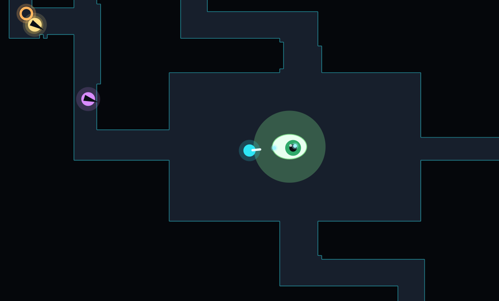
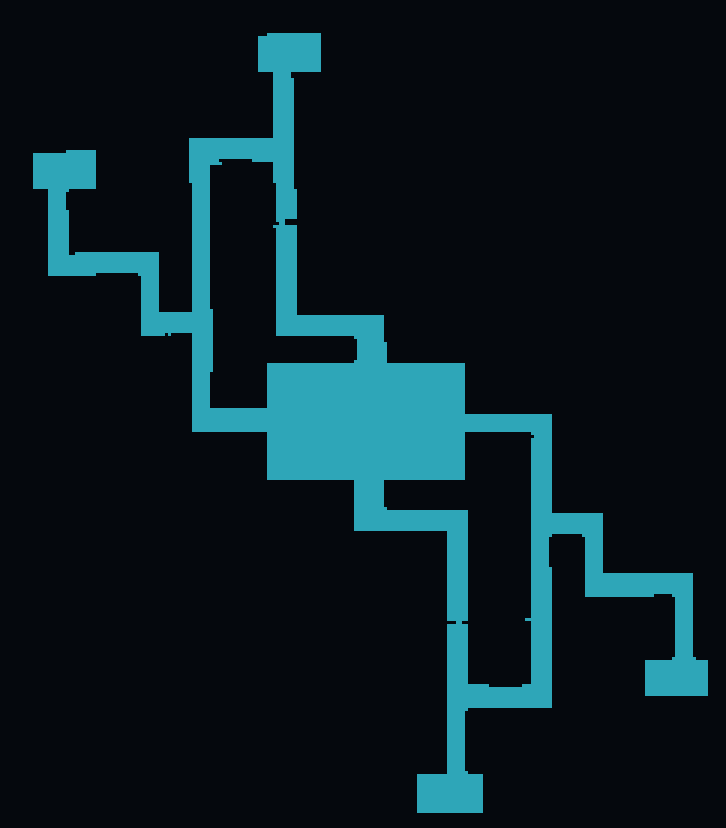
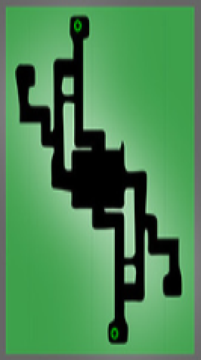

# The Amazing Race — browser port

**[▶ Play it](https://imelendez.github.io/amazing-race-web/)**

A 2D browser port of a 3D game I built in college in 2016 on the
[Panda3D](https://www.panda3d.org/) engine. Same maze, same objectives, same
four-minute clock — rebuilt as a top-down HTML5 Canvas game with no dependencies.

Kill 4 enemies, collect 3 orbs, reach the portal before the timer runs out.



*The portal — still a giant rotating eye, and still shut until you've earned it. Green means the gate is open.*

---

## The maze is the original one

This is the part I'd point at first. The floorplan wasn't redrawn by hand or eyeballed
from a screenshot — it was **extracted from the original 3D model**.

`models/solidfloormazefinal.egg` is a ~1 MB mesh with no usable 2D representation, and
sampling points inside it doesn't work: the maze has a ceiling (so "what's above this
point" is always the ceiling) and its walls are thin panels (so point sampling on a
2-unit grid walks straight through them).

What does work is scanline ray-casting. `tools/extract_maze.py` loads the model in
Panda3D and, at player chest height, fires one long ray down each grid row and one up
each grid column, recording every wall surface each ray crosses. That's 518 rays instead
of 66,792 point samples, and because a wall running east-west is caught by the column
rays while a north-south wall is caught by the row rays, the two passes together find
every panel. A flood fill from the player's spawn then discards everything unreachable,
leaving the real playfield: **242 × 276 cells, 8,582 of them walkable.**

The result matches the minimap on the original title screen exactly:

| Extracted floorplan | The original's own minimap |
| --- | --- |
|  |  |

`tools/gen_maze.py` then run-length-encodes the grid into `src/maze.js` — **the entire
maze is 2.7 KB** — and checks that all 30 spawn points (player, portal, 13 enemies, 10
orbs, 5 donuts) sit somewhere the player's collision circle can actually reach, nudging
any that don't. Exactly one donut needed nudging; the original had it clipped into a wall.

## What else came straight from the 2016 source

Read out of `FINALtheamazeingrace.py` and `utils.py` rather than reinvented:

- All 13 enemy positions, their four types, and which axis each one patrols
- Enemies patrol ±5 units at 7 units/sec and permanently turn to face the player
- All 10 orb positions **and their colors**, all 5 donut positions
- 100 health, −5 per hit taken, +15 per donut, capped at 100
- The 4:00 timer, the 3-orb / 4-kill portal gate
- The portal's refusal messages, still word for word: *"Not enough orbs." / "Not enough kills."*
- The portal is still a giant rotating eye

## What 2D needed different

Faithfulness stops where it stops being playable:

| | Original (3D) | Here (2D) |
| --- | --- | --- |
| Player shot speed | 25 u/s | 120 u/s — 25 is unreadably slow top-down |
| Enemy health | 7 hits | 5 hits — mouse aim makes hitting much easier |
| Enemy firing | fired regardless; walls ate the shots | requires line of sight (same result, less noise) |
| Aiming | turn the character, shoot forward | both: arrow keys turn, or mouse aims |
| Jumping | yes | dropped — the maze floor is flat, it was never needed |

Controls: **WASD** move, **← →** turn, **↑ ↓** forward/back, **mouse** aim,
**Space** or **click** shoot, **M** mute. Arrow keys are the original's turn-and-walk
scheme; WASD + mouse is the modern one. On a touch device you get twin sticks.

Sound is synthesized in the browser with the Web Audio API — no audio files.

## Running it

Any static server works, or just open `index.html`:

```bash
python3 serve.py 8123
```

Then <http://127.0.0.1:8123/>.

**Tests:** <http://127.0.0.1:8123/tests.html> — 29 mechanics tests that drive the real
game module through `__GAME.step()`, so they don't depend on the render loop or on
wall-clock timing.

**Build a single file:**

```bash
python3 build.py
```

Produces `dist/amazing-race.html` (~44 KB, fully self-contained — no scripts, styles,
fonts, or images loaded from anywhere) and `dist/artifact.html` for hosts that supply
their own document shell.

**Regenerate the maze** (needs the original repo and `pip install panda3d`):

```bash
python3 tools/extract_maze.py     # run from the original project directory
python3 tools/gen_maze.py         # writes src/maze.js
```

## Layout

```
index.html          page shell, styles, HUD, overlays
src/maze.js         generated — encoded floorplan + spawn tables
src/game.js         the game: simulation, rendering, input, audio
tests.html          29 mechanics tests
build.py            inlines everything into dist/
serve.py            local static server
tools/              maze extraction + encoding pipeline
```

## The original

The Panda3D version is in [TheAmazeingRace](https://github.com/imelendez/TheAmazeingRace),
and it still runs — it needed a current Panda3D and a four-line Python 2 → 3 fix, and
nothing else.

## And a 3D one

[amazing-race-3d](https://github.com/imelendez/amazing-race-3d) is a spike that takes
the original's *actual art* — the maze, the models, and Ralph's rig with all 48 joints
and both animation clips — into Three.js, with the bone rotations verified to match
Panda3D numerically. It reuses this project's wall grid for collision.
